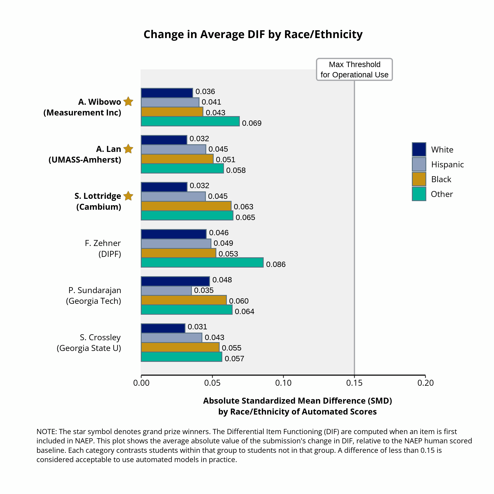
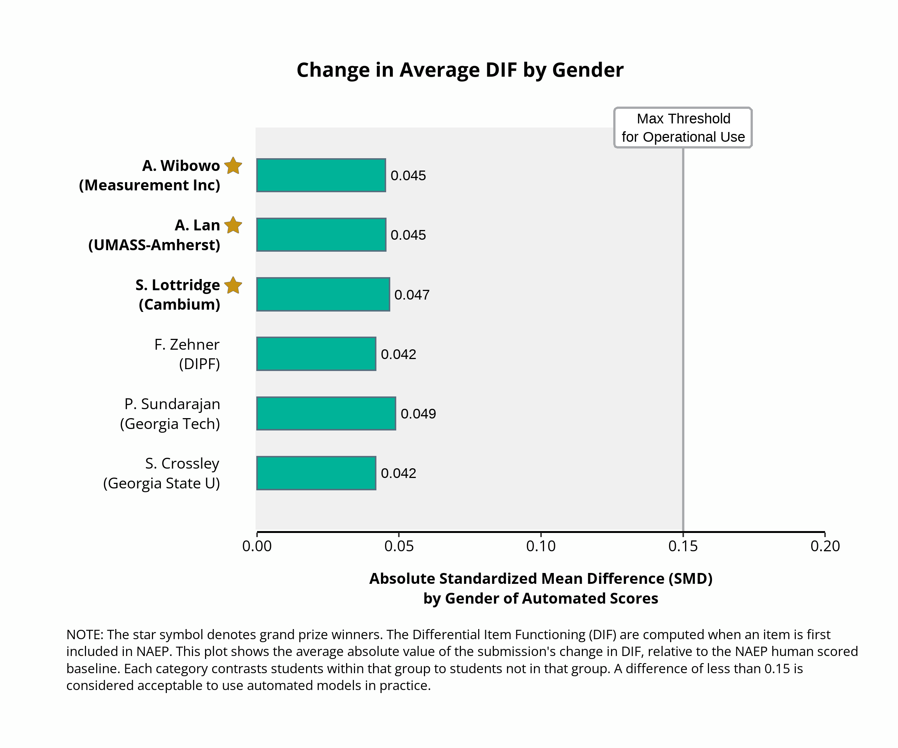
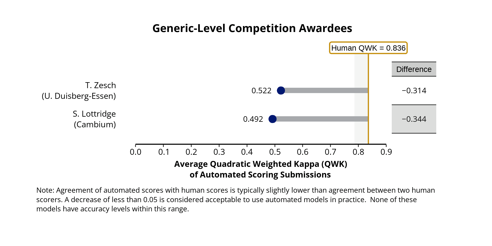

# Results from the NAEP Reading Automated Scoring Challenge
Over two dozen teams participated in this Challenge.  Out of these submissions, there were seven awards made.  The winners were identified based on the accuracy of automated scores compared to human agreement and lack of bias observed in their predictions. All awarded entries also provided technical reports that met challenge requirements for transparency, explainability and fairness.

**Grand Prizes**\
- Arianto Wibowo, Measurement Incorporated (Item-Specific Model)
- Andrew Lan, UMass-Amherst (Item-Specific Model)
- Susan Lottridge, Cambium Assessment (Item-Specific Model)
- Torsten Zesch, University of Duisburg-Essen (Generic Model)
 
**Runners-up**\
- Fabian Zehner, DIPF | Leibniz Institute for Research and Information in Education,
Centre for Technology-Based Assessment (Item-Specific Model)
- Scott Crossley, Georgia State University (Item-Specific Model)
- Prathic Sundararajan, Georgia Institute of Technology and Suraj Rajendran, Weill Cornell Medical College (Item-Specific Model)
- Susan Lottridge, Cambium Assessment (Generic Model)

### Item-Specific Challenge Results
For the item-specific challenge, three grand prize winners and three runner-up teams were selected.  All of these submissions met the requirements to use automated models in an actual test including accuracy  compared to human scoring and no substantive change in score differences based on the gender or race/ethnicity of the respondents.  The accuracy analysis of the winning submissions follows below. 

                                           
As the figure illustrates, the top three submissions had only a .011 difference in QWK values for accuracy comparing human inter-rater reliability to the agreement of automated scores with human scores.  Given how close these results are and the relatively small number of predictions in the challenge, all of these submissions were deemed to deserve a grand prize. A different set of responses could easily result in a different order of top entries by statistical chance.  All of the awarded submissions here are within the .05 QWK difference that is generally accepted for operational use of automated scoring models [(Williamson, D. M, Xi, X., & Breyer, F. J., 2012)](https://doi.org/10.1111/j.1745-3992.2011.00223.x).

The figures above illustrate the difference in results by race/ethnicity and gender compared to the difference found in human scoring. There are small differences observed in either the race or gender criteria compared to the human results; these accurate models do not exacerbate (or reduce) the differences observed in human-scored NAEP responses. The larger results observed for students in the "other" subgroup in the race/ethnicity analysis are likely the result of small sample size. Nonetheless, all results are well-within the 0.15 difference that is generally accepted for operational use. Given the importance of these differences to understanding NAEP results, this is an important outcome of the challenge. 

### Generic Challenge Results
For the generic challenge, one grand prize and one runner-up were selected. The results in this challenge were much less accurate than the item-specific models and indicate an area for further development. The accuracy analysis of the winning submissions follows below. Given the lack of accuracy, fairness analysis is not provided. 

The accuracy of these results is much better than mere chance (0.00), but these results could not be relied upon to make inferences about scoring. Whereas the top results in the item-level challenge had a degradation of 0.018, the degradation for the top generic submission is 0.314; it is over 15 times larger.  These results indicate how important the contextual information is within a NAEP reading item. While it is possible to imagine ways that generic models could be used (e.g. to score pilot-tested items for preliminary results, or provide immediate scores on new items) they are far from suitable for operational use in their current form. 

A hearty congratulations to all the participants in the challenge and appreciation from NCES for providing important insights into automated scoring of NAEP items. 