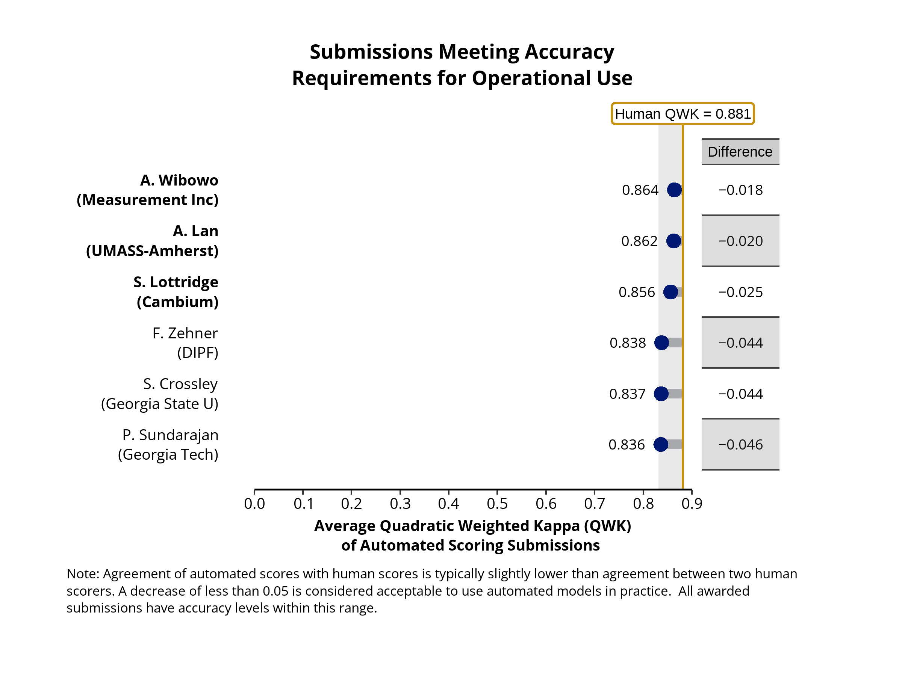

# Results to NAEP Reading Automated Scoring Challenge

## The winning submissions came from: 
**Grand Prizes**\
- Arianto Wibowo, Measurement Incorporated (Item-Specific Model)\
- Andrew Lan, UMass-Amherst (Item-Specific Model)\
- Susan Lottridge, Cambium Assessment (Item-Specific Model)\
- Torsten Zesch, University of Duisburg-Essen (Generic Model)\
 
**Runners-up**\
- Fabian Zehner, DIPF | Leibniz Institute for Research and Information in Education,
Centre for Technology-Based Assessment (Item-Specific Model)\
- Scott Crossley, Georgia State University (Item-Specific Model)\
Prathic Sundararajan, Georgia Institute of Technology and Suraj Rajendran, Weill Cornell Medical College (Item-Specific Model)\
- Susan Lottridge, Cambium Assessment (Generic Model)\

## Item-Specific Challenge Results
Over two dozen teams participated in this Challenge.  For the item-specific challenge, we selected three grand prize winners and three runner-up teams.  All of these submissions met the requirements to use these models in an actual test including accuracy  compared to human scoring and no substantive change in score differences based on the gender or race/ethnicity of the respondents.  The accuracy analysis of the winning submissions follows below. 

                                           
As the figure illustrates, the top three 

## Generic Challenge Results
Over two dozen teams participated in this Challenge.  For the generic challenge, we selected one grand prize winner and one runner-up. The results in this challenge were much less accurate than the item-specific models and indicate an area for further development. The accuracy analysis of the winning submissions follows below. 

The winning submissions came from: 

(insert image here)
                                           
As the figure illustrates, the top three 

